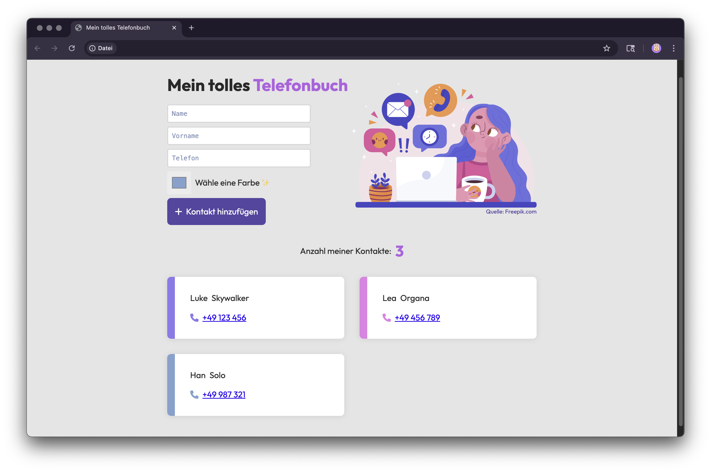

# 📞 Mein tolles Telefonbuch

Ein kleines, liebevoll gebautes Web-Tool zur Verwaltung deiner Kontakte – ganz ohne Datenbank, Server oder Cloud. Einfach lokal, einfach charmant.

## 🧩 Was kann das Telefonbuch?

- Kontakte hinzufügen: Vorname, Nachname, Telefonnummer & Wunschfarbe
- Farbiger Farbstreifen zur visuellen Kennzeichnung
- Kontakte werden im `localStorage` gespeichert und bleiben beim Neuladen erhalten
- Responsives Layout (auch mobil gut nutzbar)
- Leerzustand mit augenzwinkerndem YouTube-Video, wenn keine Kontakte vorhanden sind

## ✨ Features im Detail

- Kontaktformular mit HTML5-Validation
- Farbwähler für individuelle Kontakt-Markierung
- Illustration und Styling mit Liebe zum Detail
- Zustandserkennung: keine Kontakte → `empty state`
- Datenspeicherung im `localStorage`
- Responsive & barrierearme Gestaltung mit Flex/Grid & semantischem HTML
